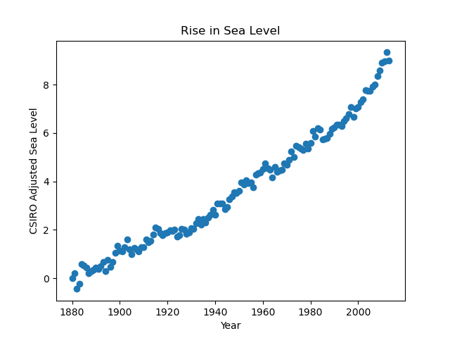
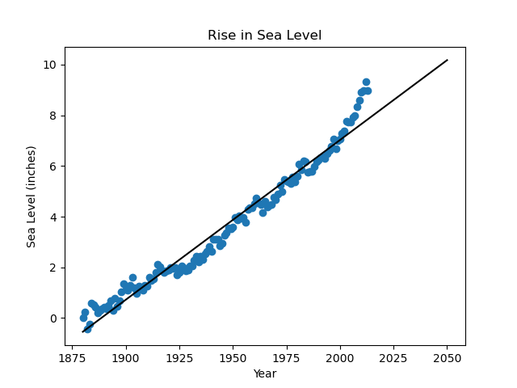
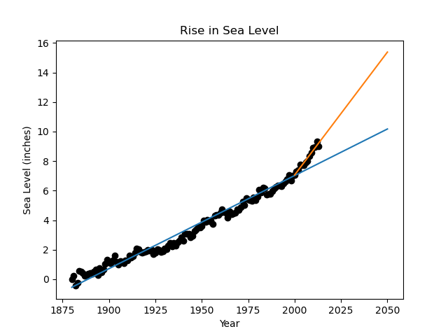

# Sea-Level-Predictor
i will analyze a dataset of the global average sea level change since 1880.i will use the data to predict the sea level change through year 2050

# Visualization Plots

## scatter Plot

## sea_level_plot_with_line_1.png

## sea_level_plot_with_line_2.png

